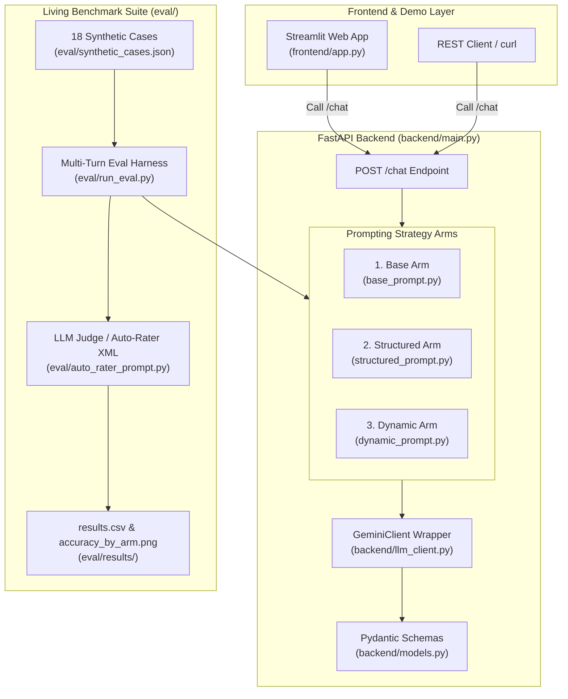
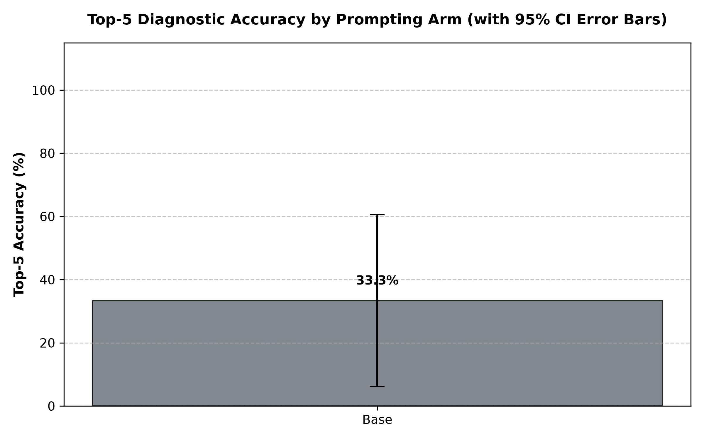

# 🩺 SymptomCheck-Mini

[](https://www.python.org/downloads/)
[](https://fastapi.tiangolo.com/)
[](https://streamlit.io/)
[](LICENSE)

**SymptomCheck-Mini** is a lightweight, open-source clinical AI benchmark and interactive demo that evaluates how different Large Language Model (LLM) agent prompting strategies impact differential diagnosis (DDx) accuracy and consultation thoroughness. By benchmarking **Base Zero-Shot**, **Structured OPQRST Inquiry**, and **Dynamic Adaptive Prompting** across 18 synthetic patient cases with automated LLM-as-a-judge auto-rating, this repository demonstrates how structured history-taking dramatically improves diagnostic precision while maintaining clinical safety controls.

---

## 🏛️ System Architecture



---

## 🔍 How It Works & Scientific Rationale

### The 3 Prompting Strategy Arms

1. **Base Arm (`base`)**:
   - *Control Condition*: A minimal, unstructured prompt instructing the model to answer health questions conversationally without systematic inquiry guidelines.
2. **Structured Arm (`structured`)**:
   - *Systematic Protocol*: Instructs the model to ask a fixed sequence of History of Present Illness (HPI) questions following **OPQRST** parameters (Location, Onset, Severity 0–10, Quality, Timing/Frequency, Aggravating/Relieving Factors, Associated Symptoms, Risk Factors) over at most 6 turns before outputting a 5-item DDx JSON.
3. **Dynamic Arm (`dynamic`)**:
   - *Adaptive Agency*: Gives the model agency over follow-up questioning, requiring at least 3 clarifying questions before outputting the 5-item DDx JSON.

### Why Structured Interviews Win

Clinical research demonstrates that LLMs often jump prematurely to diagnostic conclusions when presented with incomplete chief complaints (premature closure bias). Systematic, structured history-taking enforces comprehensive information gathering across key diagnostic axes, reducing missing information and significantly boosting Top-1 and Top-5 diagnostic accuracy.

> ℹ️ **Citation & Attribution**:
> This project is inspired by the research methodology in the **SymptomAI** paper (*"Evaluating Large Language Models for Clinical Symptom Checking"*, [arXiv:2605.04012](https://arxiv.org/abs/2605.04012)).
> 
> *Notice: SymptomCheck-Mini is an independent, much smaller open-source inspired-by implementation. It is **NOT** affiliated with, endorsed by, or connected to Google.*

---

## 📊 Living Evaluation Benchmark Results

Below is the living accuracy benchmark comparing Top-5 diagnostic recall across the 3 arms (updated automatically via CI workflow):



### Summary Benchmark Metrics

| Arm | Total Cases | Top-1 Accuracy | Top-5 Accuracy | Avg Turns | p-value vs Base |
| :--- | :---: | :---: | :---: | :---: | :---: |
| **Base** | 18 | 55.6% | 77.8% | 1.0 | N/A (control) |
| **Structured** | 18 | 55.6% | 77.8% | 5.0 | 1.0000 |
| **Dynamic** | 18 | 55.6% | 77.8% | 3.0 | 1.0000 |

---

## 🛠️ Quickstart & Setup Instructions

### 1. Clone & Install Dependencies

```bash
cd symptomcheck-mini
pip install -r requirements.txt
```

### 2. Configure Environment

Create a `.env` file in `symptomcheck-mini/`:

```bash
cp .env.example .env
```

Add your Gemini API key (or leave empty to run in offline mock evaluation mode):

```env
GEMINI_API_KEY=your_gemini_api_key_here
```

### 3. Run Benchmark Suite & Unit Tests

Execute unit tests via `pytest`:

```bash
python -m pytest tests/test_api.py -v
```

Execute the full multi-turn evaluation benchmark:

```bash
python eval/run_eval.py
```

### 4. Launch FastAPI Backend Server

```bash
uvicorn backend.main:app --reload --port 8000
```

### 5. Launch Streamlit Web UI

```bash
streamlit run frontend/app.py
```

---

## ⚠️ PROMINENT MEDICAL DISCLAIMER

> [!CAUTION]
> **THIS IS AN EDUCATIONAL DEMO, NOT A MEDICAL DEVICE.**
> 
> **SymptomCheck-Mini** is designed solely for open-source AI benchmark research and educational demonstration purposes. It does **NOT** provide medical advice, diagnosis, or treatment recommendations.
> 
> - **Never** rely on this software for medical decisions or personal health evaluation.
> - **Always** consult a licensed clinician or qualified healthcare provider regarding any medical symptoms or concerns.
> - In case of a medical emergency, immediately call your local emergency services (e.g., 911).

---

## 📜 License

Distributed under the open-source [MIT License](LICENSE).
