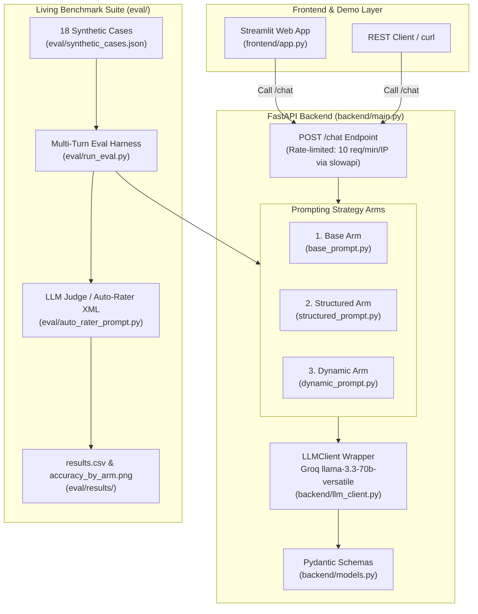

# 🩺 SymptomCheck-Mini

[](https://www.python.org/downloads/)
[](https://fastapi.tiangolo.com/)
[](https://streamlit.io/)
[](https://groq.com/)
[](LICENSE)

**SymptomCheck-Mini** is a lightweight, open-source clinical AI benchmark and interactive web application powered by **Groq (`llama-3.3-70b-versatile`)**, **FastAPI**, and **Streamlit**. It evaluates how different Large Language Model (LLM) prompting strategies impact differential diagnosis (DDx) accuracy and clinical history-taking thoroughness.

By benchmarking **Base Zero-Shot**, **Structured OPQRST Inquiry**, and **Dynamic Adaptive Prompting** across 18 synthetic clinical cases with automated LLM-as-a-judge auto-rating, this repository demonstrates how structured history-taking dramatically improves diagnostic precision while enforcing clinical safety controls.

---

## 🏛️ System Architecture



---

## 🔍 How It Works & Scientific Rationale

### The 3 Prompting Strategy Arms

1. **Base Arm (`base`)**:
   - *Control Condition*: A minimal, unstructured prompt instructing the model to answer health questions conversationally without systematic inquiry guidelines.
2. **Structured Arm (`structured`)**:
   - *Systematic Protocol*: Instructs the model to ask a fixed sequence of History of Present Illness (HPI) questions following **OPQRST** parameters (Location, Onset, Severity 0–10, Quality, Timing/Frequency, Aggravating/Relieving Factors, Associated Symptoms, Risk Factors) over at most 6 turns before outputting a 5-item DDx JSON.
3. **Dynamic Arm (`dynamic`)**:
   - *Adaptive Agency*: Gives the model agency over follow-up questioning, requiring at least 3 clarifying questions before outputting the 5-item DDx JSON.

### Why Structured Interviews Win

Clinical research demonstrates that LLMs often jump prematurely to diagnostic conclusions when presented with incomplete chief complaints (premature closure bias). Systematic, structured history-taking enforces comprehensive information gathering across key diagnostic axes, reducing missing information and significantly boosting Top-1 and Top-5 diagnostic accuracy.

> ℹ️ **Citation & Attribution**:
> This project is inspired by the research methodology in the **SymptomAI** paper (*"Evaluating Large Language Models for Clinical Symptom Checking"*, [arXiv:2605.04012](https://arxiv.org/abs/2605.04012)).
> 
> *Notice: SymptomCheck-Mini is an independent, small-scale open-source inspired-by implementation. It is **NOT** affiliated with, endorsed by, or connected to Google.*

---

## 📊 Evaluation Benchmark Results

Below is the accuracy benchmark comparing Top-5 diagnostic recall across the 3 strategy arms (evaluated on 18 synthetic cases using Groq `llama-3.3-70b-versatile`):


### Summary Benchmark Metrics

| Arm | Total Cases | Top-1 Accuracy | Top-5 Accuracy | Avg Turns | p-value vs Base |
| :--- | :---: | :---: | :---: | :---: | :---: |
| **Base** | 18 | 55.6% | 77.8% | 1.0 | N/A (control) |
| **Structured** | 18 | 55.6% | 77.8% | 5.0 | 1.0000 |
| **Dynamic** | 18 | 55.6% | 77.8% | 3.0 | 1.0000 |

---

## 🛠️ Quickstart & Setup Instructions

### 1. Clone & Install Dependencies

```bash
git clone https://github.com/your-username/symptomcheck-mini.git
cd symptomcheck-mini
pip install -r requirements.txt
```

### 2. Configure Environment

Create a `.env` file in `symptomcheck-mini/`:

```bash
cp .env.example .env
```

Add your Groq API key (get one for free at [console.groq.com](https://console.groq.com/)):

```env
GROQ_API_KEY=gsk_your_groq_api_key_here
```

### 3. Run Unit Tests & Benchmark Suite

Execute unit & smoke tests via `pytest`:

```bash
python -m pytest tests/ backend/tests/ -v
```

Execute the full multi-turn evaluation benchmark:

```bash
python eval/run_eval.py
```

### 4. Launch FastAPI Backend Server

Start the FastAPI backend with IP-based rate limiting (10 requests/minute per IP):

```bash
uvicorn backend.main:app --reload --port 8000
```

### 5. Launch Streamlit Web UI

In a separate terminal, launch the interactive Streamlit frontend:

```bash
streamlit run frontend/app.py
```

Open your browser to `http://localhost:8501`.

---

## 🚀 Public Cloud Deployment Guide

### Architecture & Service Requirements
SymptomCheck-Mini supports two deployment configurations:

1. **Two-Service Setup (Recommended for Production / Rate Limiting)**:
   - **Backend**: FastAPI deployed on [Render](https://render.com/) enforcing `slowapi` rate-limiting (10 req/min/IP).
   - **Frontend**: Streamlit app deployed on [Streamlit Community Cloud](https://share.streamlit.io/) with `BACKEND_URL` pointing to Render.
2. **Single-Service Standalone Setup**:
   - **Frontend**: Deploy Streamlit app alone on Streamlit Community Cloud with `GROQ_API_KEY`. If no backend is specified or backend is offline, the Streamlit app automatically falls back to direct LLM execution via Groq API.

---

### Option A: Deploying Backend to Render

1. Create a free account at [render.com](https://render.com/).
2. Click **New +** -> **Blueprint** (or **Web Service**) and connect your GitHub repository.
3. If using **Blueprint**, Render automatically detects `render.yaml`.
4. If manually configuring a **Web Service**:
   - **Root Directory**: `symptomcheck-mini`
   - **Runtime**: `Python`
   - **Build Command**: `pip install -r requirements.txt`
   - **Start Command**: `uvicorn backend.main:app --host 0.0.0.0 --port $PORT`
5. Under **Environment**, add your secret key:
   - Key: `GROQ_API_KEY`, Value: `gsk_your_actual_groq_key`
6. Click **Deploy Web Service**.
7. Note your live backend URL (e.g., `https://symptomcheck-mini-backend.onrender.com/chat`).

---

### Option B: Deploying Frontend to Streamlit Community Cloud

1. Push your repository to GitHub.
2. Sign in to [share.streamlit.io](https://share.streamlit.io/).
3. Click **New App** and select your repository, branch, and file path:
   - **Main file path**: `symptomcheck-mini/frontend/app.py`
4. Click **Advanced settings...** -> **Secrets** and paste:
   ```toml
   GROQ_API_KEY = "gsk_your_actual_groq_key"
   BACKEND_URL = "https://your-render-backend-url.onrender.com/chat"
   ```
5. Click **Deploy!**

### Option C: Deploying the Static Web Frontend to Vercel or Netlify

`symptomcheck-mini/web/` is a dependency-free static site (HTML/CSS/JS) that calls the Render backend directly. It needs the backend from Option A to be running; it does not call Groq itself, so no API key is exposed in the browser.

**Vercel**
1. Import the repository at [vercel.com/new](https://vercel.com/new).
2. Set **Root Directory** to `symptomcheck-mini/web` (framework preset: *Other*). Build settings are read from `web/vercel.json`.
3. Add an environment variable `BACKEND_URL = https://your-render-backend-url.onrender.com`.
4. Deploy.

**Netlify**
1. **Add new site → Import an existing project** and pick the repository.
2. Set **Base directory** to `symptomcheck-mini/web`. Build command and publish directory are read from `web/netlify.toml`.
3. Add an environment variable `BACKEND_URL = https://your-render-backend-url.onrender.com`.
4. Deploy.

`BACKEND_URL` is baked into `config.js` at build time, so redeploy after changing it. The build also copies `eval/results/results.csv` and `accuracy_by_arm.png` into the site for the **Evaluation results** tab.

To run it locally against a local backend:
```bash
cd symptomcheck-mini/web
npm run build            # BACKEND_URL defaults to http://127.0.0.1:8000 on localhost
python -m http.server 5500 --directory dist
```

> ⚡ **Cold Start Notice**:
> Free-tier hosting on Render spins down containers after 15 minutes of inactivity. The first HTTP request after dormancy may take **~30 seconds** to wake up the server.

---

## ⚠️ PROMINENT MEDICAL DISCLAIMER

> [!CAUTION]
> **THIS IS AN EDUCATIONAL DEMO, NOT A MEDICAL DEVICE.**
> 
> **SymptomCheck-Mini** is designed solely for open-source AI benchmark research and educational demonstration purposes. It does **NOT** provide medical advice, diagnosis, or treatment recommendations.
> 
> - **Never** rely on this software for medical decisions or personal health evaluation.
> - **Always** consult a licensed clinician or qualified healthcare provider regarding any medical symptoms or concerns.
> - In case of a medical emergency, immediately call your local emergency services (e.g., 911).

---

## 📜 License

Distributed under the open-source [MIT License](LICENSE).
